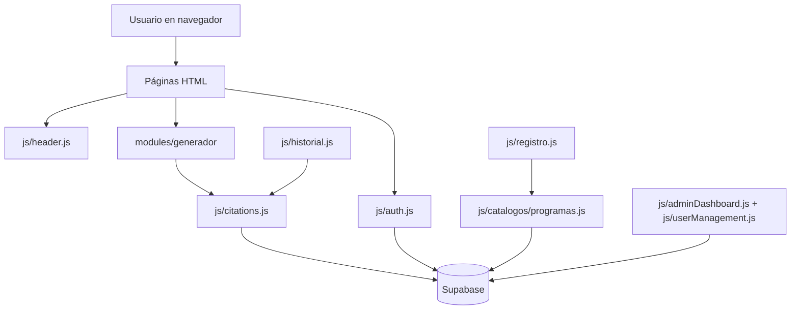
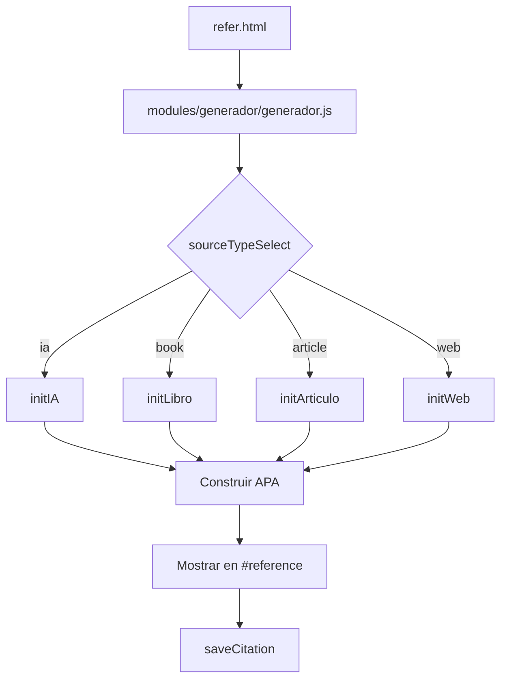
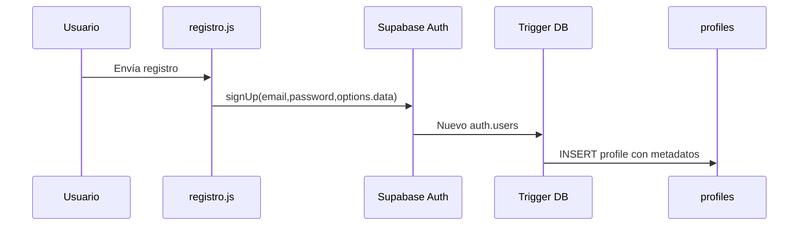
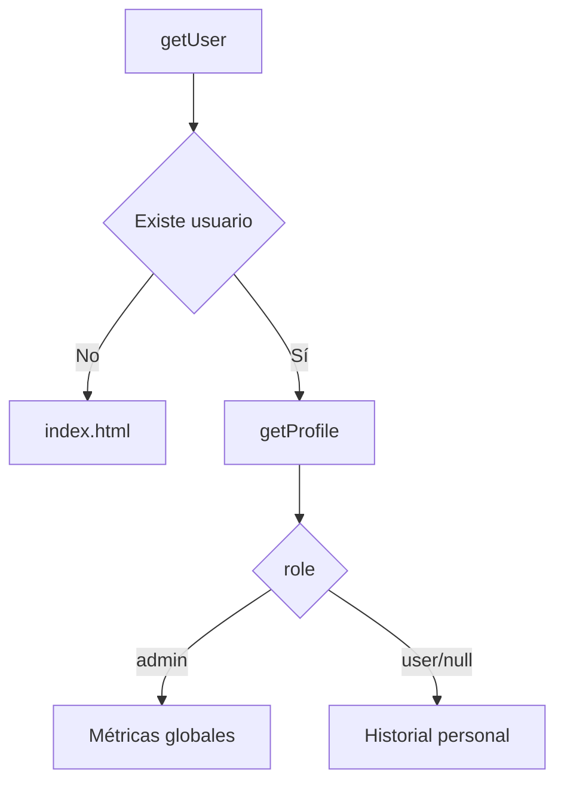
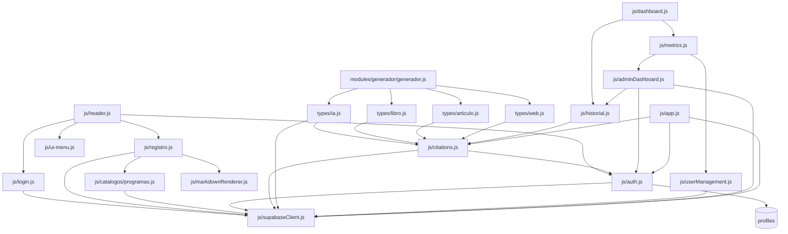
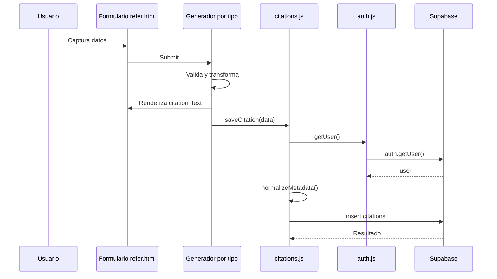

# Documentación técnica del proyecto "Generador de Referencias"

## 1. Descripción general del sistema

El proyecto es una aplicación web frontend estática para generar referencias bibliográficas, hemerográficas y webgráficas con apoyo en reglas de formato APA 7.ª edición. El sistema permite crear referencias de modelos de inteligencia artificial, libros, artículos y sitios web, mostrarlas en pantalla, copiarlas y guardarlas en Supabase asociadas al usuario autenticado.

El problema que resuelve es la captura guiada de datos mínimos para construir referencias académicas y conservar un historial de uso. Para referencias de IA, además registra tema, prompt y respuesta del modelo, lo que permite consultas posteriores y métricas administrativas.

Los usuarios objetivo observados en el código son:

- Estudiante UnADM.
- Estudiante externo.
- Figura académica UnADM.
- Usuario externo, con subtipo académico o usuario.
- Administrador, identificado por `profiles.role === 'admin'`.

Funcionalidades principales:

- Registro e inicio de sesión con Supabase Auth.
- Carga dinámica de encabezado público o autenticado.
- Generación de referencias para IA, libro, artículo y sitio web.
- Autocompletado de modelos IA desde la tabla `models` y desde un catálogo local por dominio.
- Guardado de referencias en la tabla `citations`.
- Historial personal con versión imprimible HTML.
- Métricas personales.
- Panel administrativo con gestión de usuarios, cambio de rol, historial global, filtros, paginación y exportación CSV.
- Carga del aviso de privacidad desde Markdown.

El alcance actual es un frontend sin backend propio. Toda autenticación, persistencia, catálogos y consultas dependen directamente de Supabase desde JavaScript en navegador.

## 2. Arquitectura general

La arquitectura es de aplicación estática multipágina. Cada página HTML carga módulos ES desde `js/` y, en el caso del generador actual, desde `modules/generador/`.



Arquitectura frontend:

- HTML estático para cada vista.
- CSS global en `css/styles.css`.
- Módulos ES cargados con `<script type="module">`.
- Componentes dinámicos construidos con `innerHTML`.
- Encabezados compartidos cargados por `fetch('header.html')` o `fetch('header-logged.html')`.

Arquitectura de datos:

- `models`: catálogo de modelos IA.
- `programs`: catálogo de niveles, divisiones y programas educativos.
- `profiles`: perfil extendido del usuario, rol y datos de registro.
- `citations`: referencias generadas e historial.

Relación con Supabase:

- El cliente se inicializa en `js/supabaseClient.js` con `createClient`.
- Se usa Supabase Auth para registro, login, logout y recuperación de usuario.
- Se usa Supabase Database para consultas directas a tablas.

Estrategia de autenticación:

- `auth.js` centraliza `getUser`, `getProfile`, `getUserRole`, `requireAuth`, `requireGuest`, `requireAdmin` e `initAuthListener`.
- Las vistas protegidas redirigen a `index.html` cuando no hay sesión.
- El rol se lee exclusivamente desde `profiles.role`.

Estrategia de persistencia:

- El registro usa `supabase.auth.signUp` y envía metadatos en `options.data`.
- Un trigger de base de datos, documentado en `DocTec/fix_registration_persistence.sql`, inserta esos metadatos en `profiles`.
- Las citas se insertan desde `saveCitation()` en `citations`.

## 3. Estructura de carpetas

```text
/
├── acerca.html
├── header.html
├── header-logged.html
├── historial.html
├── index.html
├── login.html
├── refer.html
├── registro.html
├── content/
│   └── aviso-privacidad.md
├── css/
│   └── styles.css
├── DocTec/
│   ├── Doc4.md
│   ├── Doc3.md
│   ├── doc1.md
│   ├── Doc_Tec.md
│   ├── documentacion_tecnica_app_citacion_ia.md
│   └── fix_registration_persistence.sql
├── img/
│   ├── Banner SSA.png
│   ├── Banner SSA - copia.png
│   ├── IA_icon.png
│   ├── cita.png
│   ├── index.jpg
│   ├── refer.png
│   ├── referencia.png
│   ├── referenciaAI.png
│   ├── referenciaPC.png
│   └── unadm-logo.jpg
├── js/
│   ├── adminDashboard.js
│   ├── app.js
│   ├── auth.js
│   ├── citations.js
│   ├── dashboard.js
│   ├── header.js
│   ├── historial.js
│   ├── login.js
│   ├── markdownRenderer.js
│   ├── metrics.js
│   ├── registro.js
│   ├── supabaseClient.js
│   ├── ui-menu.js
│   ├── userManagement.js
│   └── catalogos/
│       └── programas.js
└── modules/
    └── generador/
        ├── generador.js
        └── types/
            ├── articulo.js
            ├── ia.js
            ├── libro.js
            └── web.js
```

Propósito de carpetas:

- `content/`: contenido Markdown cargado dinámicamente. Actualmente sólo aviso de privacidad.
- `css/`: hoja de estilos global.
- `DocTec/`: documentación previa y SQL auxiliar. No es código de ejecución de la app.
- `img/`: imágenes y logos usados en páginas y encabezados.
- `js/`: módulos principales de autenticación, UI, historial, métricas, Supabase y registro.
- `js/catalogos/`: consultas de catálogos institucionales.
- `modules/generador/`: generador modular actual para tipos de fuente.

Propósito de archivos HTML:

- `index.html`: página pública de bienvenida; carga `header.js`, `app.js` y ejecuta `requireGuest()`.
- `refer.html`: vista protegida del generador; carga `modules/generador/generador.js` y exige sesión.
- `registro.html`: formulario de registro con campos dinámicos por tipo de usuario.
- `login.html`: formulario de inicio de sesión.
- `historial.html`: panel de historial personal y, para admins, sección de métricas.
- `acerca.html`: información de la aplicación, créditos y exención de responsabilidad.
- `header.html`: encabezado público con login, registro y enlace a acerca.
- `header-logged.html`: encabezado autenticado con navegación a generador, historial, métricas y logout.

## 4. Flujo completo del sistema

### Registro de usuario

Pantallas involucradas:

- `registro.html`.
- Encabezado público cargado por `js/header.js`.

Validaciones:

- `registro.js` exige nombre, correo, contraseña, confirmación, tipo de usuario y aceptación de privacidad para habilitar el botón.
- `validateFormByType()` valida campos comunes y específicos.
- Las contraseñas deben coincidir.
- Según `tipoUsuario` se exigen:
  - `estudiante_universidad`: nivel y programa.
  - `estudiante_externo`: nivel externo y programa externo.
  - `academico_universidad`: división o coordinación.
  - `externo`: subtipo académico o usuario.

Consultas a Supabase:

- `getNiveles()`: `programs.select('nivel').order('nivel')`.
- `getDivisiones(nivel)`: `programs.select('division').eq('nivel', nivel)`.
- `getProgramas(nivel, division)`: `programs.select('*').eq('nivel', nivel).eq('division', division)`.
- `getProgramasPorNivel(nivel)`: `programs.select('*').eq('nivel', nivel)`.
- Registro: `supabase.auth.signUp({ email, password, options: { data: payload } })`.

Tablas afectadas:

- `auth.users`, por Supabase Auth.
- `profiles`, indirectamente mediante trigger de base de datos descrito en `DocTec/fix_registration_persistence.sql`.

### Inicio de sesión

- `login.html` carga `js/login.js`.
- `initLogin()` ejecuta `requireGuest()` para redirigir usuarios ya autenticados a `refer.html`.
- `handleLogin()` lee `email` y `password`, valida que no estén vacíos y llama `supabase.auth.signInWithPassword`.
- Si `data.session` existe, redirige a `refer.html`.

Gestión de sesión:

- `getUser()` llama `supabase.auth.getUser()`.
- `getSession()` existe, aunque el flujo principal usa `getUser()`.
- `initAuthListener()` escucha `SIGNED_IN` y `SIGNED_OUT`.
- `SIGNED_OUT` redirige a `index.html`.

### Generación de referencias

Pantalla:

- `refer.html`.

Flujo:



Obtención de catálogos:

- IA carga `models` desde Supabase.
- IA también tiene catálogos locales `catalogoModelosIA` y `catalogoIAporDominio`.
- Registro carga programas desde `programs`.

Motor APA:

- IA: `buildAPA()` en `modules/generador/types/ia.js`.
- Libro: `buildBookAPA()`.
- Artículo: `buildArticleAPA()`.
- Web: `buildWebAPA()`.

### Guardado de referencias

Todas las referencias se guardan por `saveCitation(data)` en `js/citations.js`.

El payload final incluye:

- `user_id`: tomado de `getUser()`.
- `model_id`, `model_name_custom`, `organization_custom`.
- `version`, `consulta_fecha`, `tema`, `prompt`, `llm_response`.
- `citation_text`.
- `source_type`, por defecto `ia`.
- `metadata`, normalizada por `normalizeMetadata()`.

Inserción:

```js
supabase.from('citations').insert([payload])
```

### Consulta de historial

- `historial.html` carga `dashboard.js` e `historial.js`.
- `dashboard.js` decide si mostrar historial o métricas según rol y hash.
- `renderHistorial()` exige autenticación con `requireAuth()`.
- Consulta `getUserCitations(user)`:
  - selecciona campos de `citations`.
  - incluye relación `models(id, name)`.
  - filtra por `.eq('user_id', user.id)`.
  - ordena por `created_at` descendente.

La vista personal no implementa filtros, búsquedas ni ordenamientos interactivos. Sólo muestra las referencias ordenadas por fecha descendente desde la consulta.

### Historial global

- Disponible para `role === 'admin'`.
- `metrics.js` renderiza el contenedor administrativo.
- `adminDashboard.js` valida `requireAuth()` y `getUserRole()`.
- Consulta global:
  - `citations` con relaciones a `profiles`, `profiles.programs` y `models`.
  - orden por `created_at` descendente.

Permisos:

- El frontend oculta el botón de métricas si no es admin.
- `renderAdminDashboard()` no renderiza si el rol no es admin.
- La seguridad real debe depender de RLS en Supabase; el código no contiene definiciones RLS.

Métricas:

- Total de citas.
- Usuarios únicos.
- Modelo o tipo más usado.
- Programa más activo.
- Gestión de usuarios con conteo de citas y modelo/tipo más usado.

Filtros globales:

- Búsqueda de usuario.
- Programa.
- Modelo o tipo de referencia.
- Fecha: últimos 7 días, 30 días o año.
- Paginación con `PAGE_SIZE = 20`.

### Exportación CSV

Historial personal:

- `historial.js` contiene funciones `exportToCSV`, `exportToJSON` y `exportToHTML`.
- En UI sólo aparece `html` como opción activa.
- `exportToHTML()` genera `historial_citas.html` independiente con estilos embebidos.

Historial global:

- Botón `#export-csv` en `metrics.js`.
- `exportarHistorialCompleto()` consulta todo el historial y genera `historial_global_uso_ia.csv`.
- Campos exportados:
  - Fecha.
  - Hora.
  - Usuario.
  - Tipo de usuario.
  - División o coordinación.
  - Programa Institucional.
  - Tipo de referencia.
  - Referencia generada.
  - Modelo.
  - Tema.
  - Prompt.
  - Respuesta.
- Para referencias no IA, los campos Modelo, Tema, Prompt y Respuesta se dejan vacíos.

## 5. Base de datos

Las tablas identificadas desde el código son `profiles`, `citations`, `models` y `programs`. También se usa `auth.users` por Supabase Auth, pero no se consulta directamente desde el frontend.

### profiles

#### Propósito

Almacenar el perfil extendido del usuario, rol, tipo de usuario y vínculos a programas.

#### Campos

| Campo | Tipo | Uso |
| ----- | ---- | --- |
| id | UUID inferido | Identificador de usuario; coincide con `auth.users.id`. |
| email | texto inferido | Correo mostrado en administración. |
| full_name | texto | Nombre completo del registro. |
| role | texto | Control de permisos frontend: `user` o `admin`. |
| program_id | UUID inferido | Relación con `programs.id`. |
| tipo_usuario | texto | Tipo seleccionado en registro. |
| nivel_educativo | texto | Nivel educativo normalizado. |
| division | texto | División o coordinación. |
| matricula | texto | Matrícula opcional según tipo. |
| metadata | JSONB inferido desde SQL | Datos flexibles para externos. |

#### Relaciones

- `profiles.program_id` se relaciona con `programs.id`.
- `citations.user_id` se relaciona con `profiles.id`.

#### Restricciones observadas

- El código captura errores que incluyen `profiles_nivel_educativo_check`.
- `DocTec/fix_registration_persistence.sql` usa `NULLIF(..., '')::uuid` para `program_id`.
- El SQL define `role` por defecto como `user` mediante `COALESCE`.

#### Uso dentro del sistema

- `auth.js`: obtiene perfil y rol.
- `adminDashboard.js`: muestra usuario, programa, tipo y división.
- `userManagement.js`: lista usuarios y actualiza rol.
- `registro.js`: envía metadatos que el trigger persiste.

### citations

#### Propósito

Historial de referencias generadas por usuarios.

#### Campos

| Campo | Tipo | Uso |
| ----- | ---- | --- |
| id | UUID o identificador inferido | Identificador de cita. |
| created_at | timestamp | Fecha de creación y ordenamiento. |
| user_id | UUID | Usuario propietario. |
| model_id | UUID nullable | Modelo IA seleccionado desde catálogo. |
| model_name_custom | texto nullable | Nombre de modelo manual. |
| organization_custom | texto nullable | Organización manual. |
| version | texto nullable | Versión del modelo IA. |
| consulta_fecha | fecha/texto | Fecha de consulta o generación. |
| tema | texto nullable | Tema de referencia IA. |
| prompt | texto nullable | Prompt usado con IA. |
| llm_response | texto nullable | Respuesta del modelo. |
| citation_text | texto/html | Referencia generada. |
| source_type | texto | `ia`, `book`, `article`, `web` u otros previstos. |
| metadata | JSON/JSONB | Datos específicos por tipo de referencia. |

#### Relaciones

- `citations.user_id` con `profiles.id`.
- `citations.model_id` con `models.id`.

#### Restricciones observadas

- `saveCitation()` exige usuario autenticado antes de insertar.
- No se observan constraints SQL salvo las inferibles por relaciones.

#### Uso dentro del sistema

- `citations.js`: inserta y consulta historial personal.
- `historial.js`: renderiza historial personal.
- `dashboard.js`: calcula métricas personales.
- `adminDashboard.js`: consulta historial global y exporta CSV.
- `userManagement.js`: calcula conteo de citas por usuario.

### models

#### Propósito

Catálogo de modelos de IA y metadatos para autocompletar referencia.

#### Campos

| Campo | Tipo | Uso |
| ----- | ---- | --- |
| id | UUID inferido | Valor del `<select>` y FK en `citations.model_id`. |
| name | texto | Nombre visible del modelo. |
| organization_responsible | texto | Organización responsable. |
| model_url | texto | URL oficial del modelo/plataforma. |

#### Relaciones

- `citations.model_id` se relaciona con `models.id`.

#### Restricciones observadas

- No hay constraints visibles en el repo.

#### Uso dentro del sistema

- `modules/generador/types/ia.js` y `js/app.js`: cargan modelos y autocompletan organización/URL.
- `adminDashboard.js`: consulta nombres para métricas y filtros.
- `userManagement.js`: calcula modelos más usados.

### programs

#### Propósito

Catálogo de niveles, divisiones y programas educativos para registro y reportes.

#### Campos

| Campo | Tipo | Uso |
| ----- | ---- | --- |
| id | UUID inferido | Valor de `program_id`. |
| nombre | texto | Nombre del programa educativo. |
| nivel | texto | Nivel educativo. |
| division | texto | División académica. |

#### Relaciones

- `profiles.program_id` con `programs.id`.

#### Restricciones observadas

- No hay constraints SQL visibles en el repo.

#### Uso dentro del sistema

- `js/catalogos/programas.js`: carga niveles, divisiones y programas.
- `registro.js`: alimenta selects de registro.
- `adminDashboard.js` y `userManagement.js`: muestran programa en administración.

## 6. Módulos JavaScript

### js/supabaseClient.js

Responsabilidad: inicializa y exporta el cliente Supabase.

Funciones exportadas: `supabase`.

Dependencias:

- `https://cdn.jsdelivr.net/npm/@supabase/supabase-js/+esm`.

Configuración:

- `SUPABASE_URL = 'https://oyefwyqevymkcdpsgvkw.supabase.co'`.
- `SUPABASE_ANON_KEY` publicable en código.

### js/auth.js

Responsabilidad: capa centralizada de sesión, usuario, perfil, rol y protección de vistas.

Funciones exportadas:

- `getSession()`.
- `getUser()`.
- `getCurrentUser()`.
- `getProfile()`.
- `getUserRole()`.
- `requireAuth()`.
- `requireGuest()`.
- `requireAdmin()`.
- `initAuthListener()`.

Dependencias:

- `supabaseClient.js`.
- Tabla `profiles`.

Eventos que escucha:

- `supabase.auth.onAuthStateChange`.

Flujo:

- Recupera usuario con `supabase.auth.getUser()`.
- Recupera perfil por `profiles.id = user.id`.
- Redirige según sesión/rol.

Ejemplo práctico:

- `refer.html` llama `requireAuth()` antes de mostrar el nombre de bienvenida.

### js/header.js

Responsabilidad: cargar el encabezado correcto y conectar navegación.

Funciones internas:

- `loadHeader()`.

Dependencias:

- `supabaseClient.js`.
- `login.js`.
- `registro.js`.
- `auth.js`.
- `ui-menu.js`.

Eventos que escucha:

- `DOMContentLoaded`.
- Clicks en login, registro, generador, historial, métricas y logout.

Flujo:

- Obtiene usuario.
- Carga `header-logged.html` si hay sesión; si no, `header.html`.
- Muestra métricas sólo cuando `getUserRole()` devuelve `admin`.
- Ejecuta `initLogin()`, `initRegister()` e `initHamburgerMenu()`.

### js/login.js

Responsabilidad: inicio de sesión.

Funciones exportadas:

- `initLogin()`.

Funciones internas:

- `handleLogin(event)`.

Dependencias:

- `supabaseClient.js`.
- `auth.js`.

Eventos que escucha:

- Submit de `#loginForm`.

Flujo:

- Si la página no es `login.html`, no hace nada.
- Ejecuta `requireGuest()`.
- Envía email y password a `signInWithPassword`.
- Redirige a `refer.html` si hay sesión.

### js/registro.js

Responsabilidad: registro y lógica dinámica del formulario según tipo de usuario.

Funciones exportadas:

- `initRegister()`.

Funciones internas principales:

- `normalizarTexto()`.
- `populateDivisionOptions()`.
- `updateDivisionUI()`.
- `toggleField()`.
- `updateFieldRequired()`.
- `clearFieldsByType()`.
- `updateButtonState()`.
- `handleTipoUsuarioChange()`.
- `handleTipoExternoChange()`.
- `initDivisionsAcademico()`.
- `initProgramSelects()`.
- `initProgramSelectsExterno()`.
- `handleNivelChange()`.
- `handleDivisionChange()`.
- `loadProgramasPorNivel()`.
- `buildPayload()`.
- `validateFormByType()`.
- `handleRegister()`.

Dependencias:

- `supabaseClient.js`.
- `catalogos/programas.js`.
- `markdownRenderer.js`.

Eventos que escucha:

- Submit de `#registerForm`.
- Change de tipo de usuario, tipo externo, nivel, división y checkbox de privacidad.

Flujo:

- Carga aviso de privacidad desde `content/aviso-privacidad.md`.
- Carga catálogos desde `programs`.
- Muestra campos según tipo de usuario.
- Construye `payload` para `signUp`.

### js/catalogos/programas.js

Responsabilidad: acceso al catálogo de programas.

Funciones exportadas:

- `getNiveles()`.
- `getDivisiones(nivel)`.
- `getProgramas(nivel, division)`.
- `getProgramasPorNivel(nivel)`.

Dependencias:

- `supabaseClient.js`.

Consultas:

- Todas usan tabla `programs`.

### js/citations.js

Responsabilidad: persistencia y lectura de citas.

Funciones exportadas:

- `saveCitation(data)`.
- `getUserCitations(userParam)`.

Funciones internas:

- `normalizeMetadata(meta)`.

Dependencias:

- `supabaseClient.js`.
- `auth.js`.

Flujo:

- `saveCitation()` exige usuario autenticado, normaliza metadatos e inserta en `citations`.
- `getUserCitations()` consulta citas del usuario con relación a `models`.

### modules/generador/generador.js

Responsabilidad: enrutador del generador por tipo de fuente.

Funciones internas:

- `loadType(type)`.

Dependencias:

- `types/ia.js`.
- `types/libro.js`.
- `types/articulo.js`.
- `types/web.js`.

Eventos:

- Change de `#sourceTypeSelect`.

Flujo:

- Guarda el template IA inicial de `#generatorContainer`.
- Carga `ia` por defecto.
- Al cambiar el selector reemplaza el contenido del contenedor y llama el inicializador correspondiente.

### modules/generador/types/ia.js

Responsabilidad: formulario y generación de referencias de modelos IA.

Funciones exportadas:

- `initIA(container)`.

Funciones internas:

- `loadModels()`.
- `populateModelSelect()`.
- `extractDomainFromUrl()`.
- `parseLocalDate()`.
- `formatDateSpanish()`.
- `buildAPA()`.
- `getEl()`.

Dependencias:

- `supabaseClient.js`.
- `auth.js`.
- `citations.js`.

Eventos:

- Change de modelo.
- Input de modelo personalizado y organización.
- Blur de URL de plataforma.
- Submit de `#refForm`.
- Click de `#copyBtn`.

Flujo:

- Carga modelos desde Supabase.
- Agrega opción `Otro modelo`.
- Autocompleta por dominio cuando se reconoce la URL.
- Construye referencia:
  - Organización.
  - Fecha de consulta en paréntesis.
  - Modelo en cursiva y versión opcional.
  - Etiqueta `[Modelo de lenguaje de gran escala]`.
  - URL.
- Guarda en `citations` con `source_type` por defecto `ia`.

### modules/generador/types/libro.js

Responsabilidad: formulario, autores dinámicos y referencia de libro.

Funciones exportadas:

- `initLibro(container)`.

Funciones internas:

- `extractApellidoAPA()`.
- `capitalizeWord()`.
- `formatIniciales()`.
- `capitalizeApellido()`.
- `formatAuthorAPA()`.
- `formatMultipleAuthorsAPA()`.
- `formatAuthorsReference()`.
- `formatInTextCitation()`.
- `createAuthorField()`.
- `getAuthorsData()`.
- `updateAuthorPreview()`.
- `buildBookAPA()`.

Dependencias:

- `citations.js`.

Eventos:

- Input en autores.
- Click para agregar/eliminar autores.
- Submit de `#bookForm`.

Ejemplo:

- Genera: `Apellido, N. (2020). <em>Título</em>. Editorial. URL`

### modules/generador/types/articulo.js

Responsabilidad: referencias de revista académica, artículo web y periódico.

Funciones exportadas:

- `initArticulo(container)`.

Funciones internas:

- Funciones de autor equivalentes a libro.
- `formatArticleTitle()`.
- `buildArticleAPA()`.
- `updateTypeSpecificFields()`.

Dependencias:

- `citations.js`.

Eventos:

- Change de tipo de artículo.
- Input en autores.
- Click agregar/eliminar autor.
- Submit de `#articleForm`.

Flujo:

- Alterna campos específicos para `journal`, `web` y `newspaper`.
- Ajusta `required` según tipo.
- Guarda `source_type: 'article'`.

### modules/generador/types/web.js

Responsabilidad: referencias de sitios web.

Funciones exportadas:

- `initWeb(container)`.

Funciones internas:

- Funciones de autor equivalentes a libro.
- `formatInTextCitation()`.
- `formatWebTitle()`.
- `formatDate()`.
- `formatRecoveryDate()`.
- `cleanUrl()`.
- `buildWebAPA()`.
- `updateAuthorTypeFields()`.

Dependencias:

- `citations.js`.

Eventos:

- Change de tipo de autor.
- Change de fecha de recuperación.
- Input en autores.
- Click agregar/eliminar autor.
- Submit de `#webForm`.

Flujo:

- Soporta autor persona, organización o sin autor.
- Permite fecha sin año, con salida `(s. f.)`.
- Si se activa recuperación, genera `Recuperado el ... de URL`.
- Guarda `source_type: 'web'`.

### js/historial.js

Responsabilidad: historial personal, render de detalle y exportación imprimible.

Funciones exportadas:

- `renderMarkdown(markdownText)`.
- `renderCitationDetail(c)`.
- `renderHistorial()`.

Funciones internas:

- `escapeCSV()`.
- `downloadFile()`.
- `exportToCSV()`.
- `exportToJSON()`.
- `escapeHtml()`.
- `getAutor()`.
- `formatWebMetadataDate()`.
- `formatDateForPrint()`.
- `renderIACitation()`.
- `renderBookCitation()`.
- `renderArticleCitation()`.
- `renderWebCitation()`.
- `exportToHTML()`.

Dependencias:

- `auth.js`.
- `citations.js`.
- Librerías globales opcionales `marked` y `DOMPurify`.

Eventos:

- Click de descarga de historial.

Flujo:

- Exige sesión.
- Consulta citas del usuario.
- Renderiza según `source_type`.
- Exporta HTML imprimible.

### js/dashboard.js

Responsabilidad: orquestar secciones de `historial.html` y métricas personales.

Funciones exportadas:

- `renderUserDashboard()`.
- `showSection()`.
- `showHistorial()`.
- `showMetrics()`.
- `loadUserDashboard()`.
- `initDashboardSections()`.

Dependencias:

- `auth.js`.
- `citations.js`.
- `historial.js`.
- `metrics.js`.
- Importa `supabase` pero no lo usa.

Eventos:

- `DOMContentLoaded`.

Flujo:

- Protege la página.
- Si admin y hash `#metrics`, muestra métricas globales.
- En otros casos muestra historial y métricas personales.

### js/metrics.js

Responsabilidad: construir la sección administrativa.

Funciones exportadas:

- `renderMetrics()`.

Dependencias:

- `userManagement.js`.
- `adminDashboard.js`.

Flujo:

- Inyecta gestión de usuarios e historial global.
- Inicializa ambas áreas.

### js/userManagement.js

Responsabilidad: gestión de usuarios en panel admin.

Funciones exportadas:

- `loadUsers()`.
- `calculateUserMetrics(users)`.
- `renderUsersTable(users)`.
- `filterUsers()`.
- `updateUserRole(userId, newRole)`.
- `initializeUserSection()`.

Funciones internas:

- `getProgramEducativo(usuario)`.

Dependencias:

- `supabaseClient.js`.

Consultas:

- `profiles` con relación `programs`.
- `citations`.
- `models`.
- Actualiza `profiles.role`.

Eventos:

- Change de selector de rol.
- Input/change de búsqueda y filtro de rol.

### js/adminDashboard.js

Responsabilidad: métricas globales, historial global, filtros, modal y exportación CSV.

Funciones exportadas:

- `renderAdminDashboard()`.

Funciones internas principales:

- `getModelColor()`.
- `getNonIAModelIcon()`.
- `renderGlobalCitationHistory()`.
- `exportToCSV()`.
- `getProgramName()`.
- `exportarHistorialCompleto()`.
- `loadPage()`.
- `getReferenceTypeLabel()`.
- `computeSummary()`.
- `renderFilters()`.
- `renderSummary()`.
- `renderTablePage()`.
- `renderPagination()`.
- `showCitationModal()`.

Dependencias:

- `auth.js`.
- `supabaseClient.js`.
- `historial.js`.

Eventos:

- `DOMContentLoaded`.
- Filtros de historial global.
- Paginación.
- Botones `Ver`.
- Botón `#export-csv`.

Flujo:

- Verifica admin.
- Consulta citas globales.
- Calcula métricas.
- Carga historial paginado de 20 registros.
- Aplica filtros parcialmente en Supabase y parcialmente en cliente.
- Exporta CSV con consulta completa independiente.

### js/markdownRenderer.js

Responsabilidad: cargar y renderizar Markdown básico.

Funciones exportadas:

- `loadMarkdownContent(filePath, containerId)`.
- `loadMultipleMarkdownContents(items)`.
- `markdownToHtml(markdown)`.

Eventos:

- Ninguno propio.

Uso:

- `registro.js` carga el aviso de privacidad.

### js/ui-menu.js

Responsabilidad: menú hamburguesa móvil.

Funciones exportadas:

- `initHamburgerMenu()`.

Eventos:

- Click en `#hamburgerBtn`.
- Click en `#headerNav`.

### js/app.js

Responsabilidad: implementación anterior/directa del generador IA.

Estado observado:

- `index.html` e `historial.html` lo cargan.
- `refer.html` ya no lo carga; usa `modules/generador/generador.js`.
- Si no existe `#refForm`, el módulo abandona la lógica principal.

Funciones exportadas:

- `loadModels()`.

Observación:

- Duplica gran parte de `modules/generador/types/ia.js`: carga modelos, catálogos locales, autocompletado, `buildAPA()`, guardado y copiado.

## 7. Sistema de autenticación

El sistema usa Supabase Auth desde el cliente oficial cargado por CDN.



Registro:

- `registro.js` valida el formulario.
- Envía metadatos a `supabase.auth.signUp`.
- El trigger `handle_new_user()` del SQL auxiliar inserta en `profiles`.

Login:

- `login.js` llama `signInWithPassword`.
- Redirige a `refer.html` con sesión activa.

Logout:

- `header.js` ejecuta `supabase.auth.signOut()`.
- Después redirige a `index.html`.

Recuperación de sesión:

- `getUser()` llama `supabase.auth.getUser()`.
- `header.js` decide encabezado público/autenticado a partir de ese usuario.

Protección de vistas:

- `requireAuth()` redirige a `index.html` si no hay usuario.
- `requireGuest()` redirige a `refer.html` si ya hay sesión.
- `requireAdmin()` existe, aunque el panel usa directamente `getUserRole()`.

Roles y permisos:

- El rol se obtiene de `profiles.role`.
- `admin` habilita el botón Métricas y renderiza historial global.
- Otros roles se tratan como usuario normal.



## 8. Generador de referencias APA

El generador actual está en `modules/generador/`. El selector de `refer.html` permite elegir tipo.

### Algoritmo general

1. Renderizar formulario del tipo seleccionado.
2. Validar campos HTML nativos y validaciones adicionales.
3. Normalizar autores, fechas, URL o modelo según tipo.
4. Construir cadena HTML con cursivas mediante `<em>`.
5. Mostrar en `#reference`.
6. Guardar con `saveCitation()`.

### Reglas implementadas

Autores persona:

- Se capturan nombre y apellido por separado.
- `formatIniciales()` convierte nombres a iniciales.
- `extractApellidoAPA()` intenta manejar conectores como `de`, `del`, `de la`, `van der`.
- Un autor: `Apellido, N.`
- Dos autores: `Autor 1 & Autor 2`.
- Tres o más autores: `Autor 1, Autor 2, & Autor N`.
- Cita parentética interna guardada en metadata:
  - Un autor: `Apellido, año`.
  - Dos: `Apellido y Apellido, año`.
  - Más: `Apellido et al., año`.

IA:

- Formato observado:
  - `Organización (año, día de mes). <em>Modelo</em> (versión X) [Modelo de lenguaje de gran escala]. URL`
- Si no hay versión, omite `(versión X)`.
- Fecha desde `consulta-fecha`, con parseo local para evitar desfase UTC.
- Escapa HTML de entradas de usuario en `buildAPA()`.

Libro:

- Formato observado:
  - `Autores (año). <em>Título</em>. Editorial. DOI/URL`
- DOI/URL es opcional.

Artículo:

- Tipos soportados:
  - `journal`: revista académica.
  - `web`: artículo web.
  - `newspaper`: periódico.
- Revista:
  - `Autores (año). Título. <em>Revista</em>, <em>volumen</em>(número), páginas. DOI/URL`
- Artículo web:
  - `Autores (año, día mes). Título. <em>Sitio</em>. URL`
- Periódico:
  - `Autores (año, día mes). Título. <em>Periódico</em>, páginas.`

Web:

- Autor persona, organización o sin autor.
- Sin año genera `(s. f.)`.
- Persona/organización:
  - `Autor (fecha). <em>Título</em>. <em>Sitio</em>. URL`
- Sin autor:
  - `<em>Título</em>. (fecha). <em>Sitio</em>. URL`
- Si hay fecha de recuperación:
  - `Recuperado el día de mes de año de URL`
- Evita repetir el sitio si el autor organización coincide con el nombre del sitio.

### Catálogos utilizados

- `models` en Supabase para IA.
- Catálogo local de modelos IA en `ia.js` y duplicado en `app.js`.
- Catálogo local por dominio en `ia.js` y `app.js`.

### Manejo de modelos de IA

- Si el usuario selecciona un modelo de Supabase, se guarda `model_id`.
- Si selecciona `Otro modelo`, se guarda `model_name_custom` y `organization_custom`.
- Si el valor seleccionado no parece UUID ni está en caché, se trata como personalizado.

### Manejo de URLs

- IA extrae dominio con `new URL(urlStr)`.
- Web elimina puntos finales con `cleanUrl()`.
- Los formularios usan `input type="url"` para URL obligatorias.

### Manejo de fechas

- IA usa `parseLocalDate()` para `YYYY-MM-DD`.
- Web permite año/mes/día parciales.
- Artículos web y periódico usan día y mes para fecha completa dentro del paréntesis.

### Casos especiales

- IA autocompleta fecha actual si la URL se reconoce o no se reconoce y el campo está vacío.
- Web permite `Sin autor`.
- Académicos con división CAI se muestran con programa especial en administración.

## 9. Gestión de catálogos

Origen:

- `programs`: Supabase.
- `models`: Supabase.
- Modelos IA por nombre/dominio: objetos locales en `ia.js` y `app.js`.

Estructura de `programs`:

- `nivel`.
- `division`.
- `nombre`.
- `id`.

Cómo se cargan:

- Registro usa `getNiveles()`, `getDivisiones()`, `getProgramas()` y `getProgramasPorNivel()`.
- Los resultados se deduplican con `Set` y se ordenan con `localeCompare`.

Cómo se actualizan:

- No hay UI para actualizar catálogos.
- Deben modificarse directamente en Supabase o en los objetos locales para el catálogo IA por dominio.

Dependencias:

- Registro depende de `programs`.
- Generador IA depende de `models` y catálogos locales.
- Admin depende de relaciones `profiles.programs` y `citations.models`.

## 10. Seguridad

Validaciones frontend:

- Campos `required`, tipos HTML (`email`, `password`, `date`, `url`, `number`).
- Validaciones por tipo de usuario en registro.
- Validaciones por tipo de referencia en generadores.
- Verificación de sesión antes de guardar citas.
- Verificación de rol admin antes de renderizar métricas.

Sanitización:

- IA escapa valores en `buildAPA()`.
- Historial usa `renderMarkdown()` con `marked` si está disponible y `DOMPurify.sanitize()` si está disponible.
- `markdownRenderer.js` escapa HTML antes de convertir Markdown básico.
- Varias vistas administrativas insertan datos con `innerHTML` sin escape universal; esto es un riesgo si datos almacenados contienen HTML malicioso.

Protección contra accesos no autorizados:

- Frontend redirige usuarios no autenticados.
- Frontend oculta y bloquea render admin para no admins.
- Esto no sustituye RLS.

Dependencia de RLS:

- El código consulta directamente Supabase con llave publicable.
- Por lo tanto, la protección real de:
  - leer sólo citas propias,
  - impedir lectura global a no admins,
  - impedir cambio de roles por usuarios normales,
  - proteger `profiles`,
  debe estar implementada con RLS/policies en Supabase.

Riesgos potenciales:

- La llave publicable de Supabase está en el frontend, normal para cliente público, pero obliga a RLS estricta.
- No hay políticas RLS en el repo; sólo pueden inferirse requerimientos.
- `userManagement.updateUserRole()` actualiza `profiles.role` desde frontend; debe estar restringido por RLS a admins.
- Duplicación entre `js/app.js` y `modules/generador/types/ia.js` aumenta riesgo de divergencia.
- El HTML generado desde datos de usuario se inserta con `innerHTML` en varios módulos.

## 11. Dependencias entre módulos



## 12. Flujo completo de datos



Entradas:

- Datos de formulario.
- Catálogos `models` y `programs`.
- Usuario autenticado.

Transformaciones:

- Normalización de autores.
- Formateo de fecha.
- Sanitización parcial de HTML.
- Normalización de `metadata`.
- Mapeo de tipo de usuario a payload de registro.

Consultas:

- `models.select(...)`.
- `programs.select(...)`.
- `profiles.select(...)`.
- `citations.insert(...)`.
- `citations.select(...)`.

Persistencia:

- Usuarios: `auth.users` y `profiles`.
- Referencias: `citations`.

## 13. Configuración y despliegue

Variables de configuración encontradas:

- `SUPABASE_URL` en `js/supabaseClient.js`.
- `SUPABASE_ANON_KEY` en `js/supabaseClient.js`.

Dependencias externas:

- Supabase JS desde CDN.
- `marked` desde CDN en `historial.html`.
- `DOMPurify` desde CDN en `historial.html`.

Inicialización de Supabase:

```js
import { createClient } from 'https://cdn.jsdelivr.net/npm/@supabase/supabase-js/+esm';
export const supabase = createClient(SUPABASE_URL, SUPABASE_ANON_KEY);
```

Requisitos para ejecución local:

- Servir los archivos por HTTP. Algunas funciones usan `fetch()` para cargar header y Markdown, por lo que abrir HTML directamente con `file://` puede fallar por restricciones del navegador.
- Acceso a internet para Supabase y CDNs.
- Proyecto Supabase con tablas y relaciones esperadas.

Requisitos para producción:

- Hosting estático.
- RLS configurado en Supabase.
- Trigger `handle_new_user()` o equivalente para persistir perfiles.
- Tablas `profiles`, `citations`, `models`, `programs`.
- Relaciones entre tablas configuradas para que los selects anidados funcionen.

## 14. Guía de mantenimiento

### Cómo agregar un nuevo modelo de IA

Si el modelo debe ser institucional:

1. Agregar registro en Supabase `models` con `name`, `organization_responsible` y `model_url`.
2. El generador IA lo cargará automáticamente desde `loadModels()`.

Si también se quiere autocompletar por dominio:

1. Agregar entrada en `catalogoIAporDominio` dentro de `modules/generador/types/ia.js`.
2. Si se conserva `js/app.js`, replicar ahí el cambio o refactorizar para eliminar la duplicación.

### Cómo modificar el formato APA

- IA: editar `buildAPA()` en `modules/generador/types/ia.js`.
- Libro: editar `buildBookAPA()` en `modules/generador/types/libro.js`.
- Artículo: editar `buildArticleAPA()` en `modules/generador/types/articulo.js`.
- Web: editar `buildWebAPA()` en `modules/generador/types/web.js`.
- Revisar también render de historial en `js/historial.js` si cambia metadata.

### Cómo agregar nuevos campos de usuario

1. Agregar inputs en `registro.html`.
2. Mostrar/ocultar y validar en `registro.js`.
3. Incluir en `buildPayload()`.
4. Actualizar trigger de Supabase similar a `DocTec/fix_registration_persistence.sql`.
5. Actualizar consultas y tablas administrativas en `userManagement.js` y `adminDashboard.js` si se deben mostrar.

### Cómo agregar nuevos reportes

1. Crear contenedor en `metrics.js` o en una nueva sección.
2. Consultar datos desde Supabase en un módulo separado o en `adminDashboard.js`.
3. Validar rol con `getUserRole()`.
4. Asegurar RLS para lectura administrativa.

### Cómo agregar nuevas exportaciones

Historial personal:

- Activar opciones en `historial.html` y conectar con `exportToCSV()` o `exportToJSON()` existentes.

Historial global:

- Extender `exportarHistorialCompleto()` en `adminDashboard.js` o crear una función nueva.
- Definir columnas, transformaciones y nombre de archivo.

## 15. Deuda técnica y observaciones

Código duplicado:

- `js/app.js` duplica el generador IA que ahora existe en `modules/generador/types/ia.js`.
- Las funciones de autor APA se repiten en `libro.js`, `articulo.js` y `web.js`.

Acoplamiento excesivo:

- Módulos construyen HTML con `innerHTML` y lógica de negocio en el mismo archivo.
- `adminDashboard.js` concentra métricas, filtros, paginación, modal y exportación.
- `header.js` inicializa login y registro aunque no siempre esté en esas páginas.

Posibles mejoras:

- Extraer utilidades APA compartidas para autores, fechas y escape HTML.
- Centralizar catálogos IA locales en un solo módulo.
- Eliminar o actualizar `js/app.js` si ya no se usa como generador principal.
- Añadir pruebas unitarias para `buildAPA`, `buildBookAPA`, `buildArticleAPA`, `buildWebAPA` y normalización de metadata.
- Escapar de forma consistente datos insertados con `innerHTML`.
- Convertir funciones de exportación en módulo dedicado.

Riesgos de mantenimiento:

- Cambios en Supabase sin actualizar frontend pueden romper selects anidados.
- Si RLS no está bien configurado, usuarios podrían consultar o modificar datos no autorizados.
- El cambio de rol desde frontend es sensible y requiere política estricta.
- La exportación global consulta todo el historial, lo cual puede ser pesado con muchos registros.

Oportunidades de refactorización:

- Crear `js/apaAuthors.js`.
- Crear `js/apaDates.js`.
- Crear `js/catalogos/modelosIA.js`.
- Crear `js/exporters.js`.
- Separar `adminDashboard.js` en `adminMetrics`, `globalHistory`, `csvExport` y `citationModal`.

Elementos no determinados con certeza:

- Las políticas RLS reales no están en el proyecto.
- El esquema completo de Supabase no está en el proyecto; sólo se documentan campos usados o inferidos desde consultas y SQL auxiliar.
- No se observa sistema de build, gestor de paquetes ni pruebas automatizadas.
